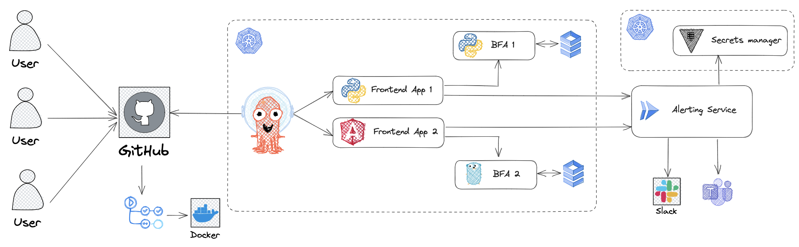
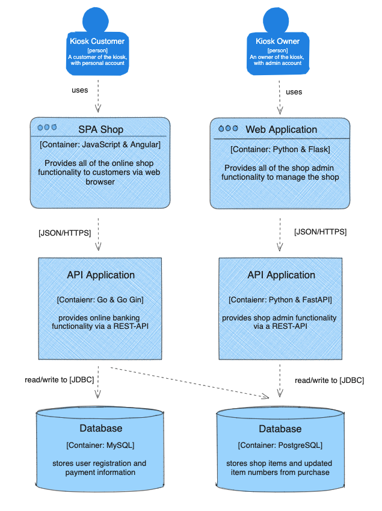
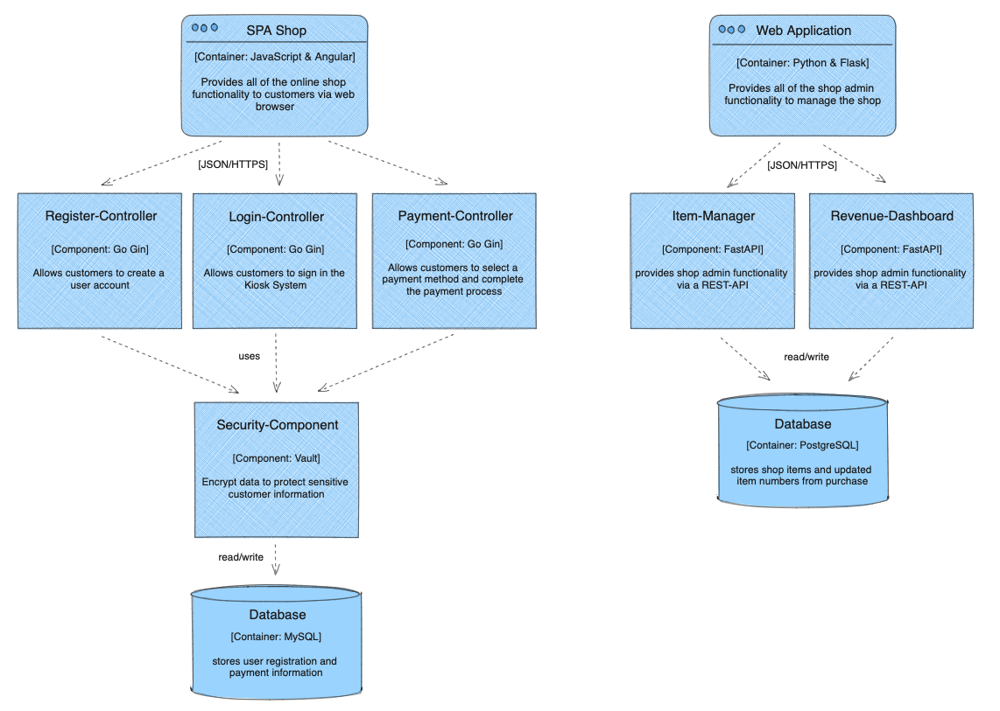

# Cloud-Native Microservices Platform



## Overview

This project demonstrates the design and deployment of a cloud-native microservices application using modern DevOps and cloud technologies. The application is built with Flask (frontend) and FastAPI (backend), containerized using Docker, and deployed using Kubernetes.

The objective of this project is to gain hands-on experience with container orchestration, CI/CD automation, infrastructure provisioning, and monitoring in a cloud environment.

Technologies explored include Docker, Kubernetes, Terraform, CI/CD pipelines, and cloud deployment practices.

---

## Application Description

The system simulates a kiosk-style application where users can browse products, manage accounts, and add items to a shopping cart. The architecture follows a microservices-based approach allowing services to be independently deployed and managed.

Key functionalities include:

* Product browsing
* User account creation and management
* Shopping cart functionality
* Backend API services for application operations

---

## Architecture

### Container Architecture



### Component Architecture



The system is composed of multiple containerized services managed through Kubernetes. CI/CD pipelines automate the build and deployment process, while monitoring tools provide system observability.

---

## Tech Stack

Frontend: Flask
Backend: FastAPI
Containerization: Docker
Orchestration: Kubernetes
CI/CD: GitHub Actions
GitOps: ArgoCD
Infrastructure as Code: Terraform
Monitoring: Prometheus & Grafana
Cloud Platforms: AWS / GCP

---

## Application Use Cases

* Users can view available products
* Users can create and manage accounts
* Users can add items to a shopping cart
* Backend services handle API requests and data processing

---

## Local Development

### Run a Local Kubernetes Cluster

Start a local cluster using Minikube:

```bash
minikube start --cpus 2 --memory 8192
minikube profile list
minikube ip
```

Enable the ingress controller:

```bash
minikube addons enable ingress
```

Verify the controller:

```bash
kubectl get pods -n ingress-nginx
```

---

### Configure Local Domain

Add local domain mapping:

```bash
echo -e "$(minikube ip)\tcnk.local" | sudo tee -a /etc/hosts
```

---

### Manual Deployment

Deploy Kubernetes resources:

```bash
kubectl apply -f deploy/
```

Check deployment status:

```bash
kubectl get pods
kubectl get services
```

---

## Monitoring

Install the monitoring stack:

```bash
bash monitoring/prometheus.sh
bash monitoring/grafana.sh
```

Access Grafana dashboard:

```
http://localhost:3000
```

---

## Cleanup

Remove deployed resources:

```bash
kubectl delete -f deploy/
minikube delete --all
```

---

## Database Connection Test

```bash
INSTANCE_NAME="cnk-sql-instance"
gcloud sql connect ${INSTANCE_NAME} --user=postgres --quiet
```

Or use Cloud SQL Proxy:

```bash
curl -o cloud_sql_proxy https://dl.google.com/cloudsql/cloud_sql_proxy.darwin.amd64
chmod +x cloud_sql_proxy
./cloud_sql_proxy -instances=${INSTANCE_NAME}=tcp:3306
```

---

## Learning Outcomes

This project demonstrates practical experience with:

* Cloud-native application development
* Containerized microservices architecture
* Kubernetes deployment and orchestration
* CI/CD automation
* Infrastructure as Code
* Monitoring and observability for distributed systems

---


